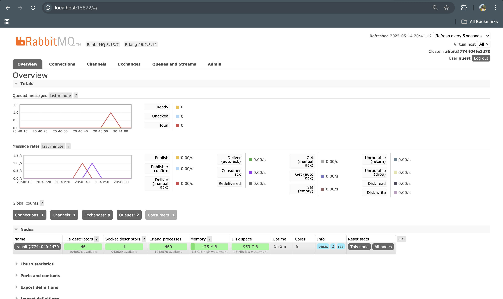

# Module: 9 Subscriber
**NPM:** 2306174135  
**Name:** Andhika Nayaka Arya Wibowo

## What is AMQP?

AMQP (Advanced Message Queuing Protocol) is an open standard application layer protocol for message-oriented middleware. It enables systems to communicate by sending and receiving messages through a broker, ensuring reliable delivery, message orientation, queuing, routing, and security.

## What does it mean? guest:guest@localhost:5672 , what is the first guest, and what is the second guest, and what is localhost:5672 is for? `

- **`guest:guest`**
    - The first `guest` is the **username** used to authenticate with the RabbitMQ broker.
    - The second `guest` is the **password** for that user.
- **`localhost:5672`**
    - `localhost` indicates the **host** where the RabbitMQ broker is running (in this case, your local machine).
    - `5672` is the **port** on which the RabbitMQ broker listens for AMQP connections.

### - Simulation slow subscriber:
  
  **Why did the queue length reach 26 messages on my machine?**  
  - My producer was publishing events faster than the subscriber could handle them, so messages piled up in the queue until the subscriber caught up and processed them one by one. On your machine you might see a different peak (for example, 20) depending on how quickly your subscriber consumes messages.